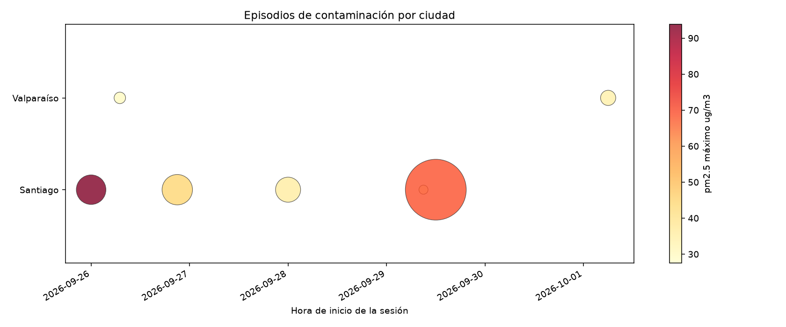
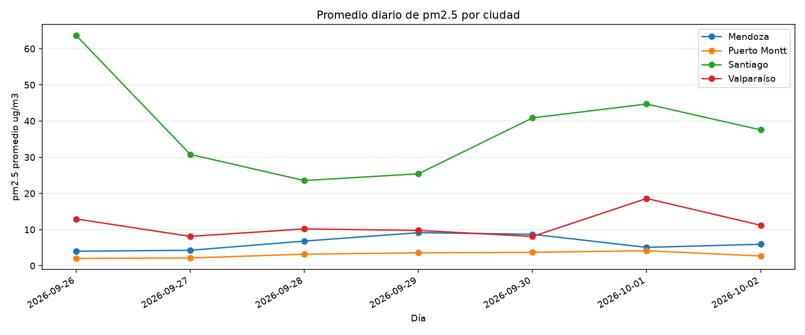

# Laboratorio 03 de Big Data

Arquitectura Lambda con calidad del aire

Fecha de exposición: 6 de octubre de 2026

Comenzado el 28 de septiembre de 2026

## Integrantes

Matias Huerta

Santiago Herrera

Ignacio Ampuero

Engel Falcon

---

## Índice

1. Introducción

2. Objetivos

3. Arquitectura elegida y justificación

4. Materiales y entorno

5. Herramientas: qué son y cómo se usa cada una

6. Diseño del pipeline

7. Ejecución paso a paso

8. Resultados

9. Resolución de problemas y tips

10. Cronología de avances

11. Reproducibilidad

12. Conclusiones

Anexo A. Glosario de términos

Anexo B. Evidencias

---

## 1. Introducción

El Laboratorio 03 construye una arquitectura Lambda sobre el problema de fondo del curso, la calidad del aire en cuatro ciudades chilenas, de modo que la misma pregunta pueda responderse con tres arquitecturas distintas y la comparación sea justa.

El flujo parte de una única foto de los datos que se descarga antes de correr nada, con `01_descargar.py` como el único script autorizado a tocar la red, y queda en disco junto a un manifiesto en JSON con la dirección usada, la fecha de descarga y el hash SHA-256 del contenido.

Esa foto es la base de la reproducibilidad, porque con el hash se puede demostrar que dos corridas partieron de los mismos datos, y porque después de la descarga todo el pipeline lee del disco y una caída de internet ya no afecta la demostración.

El dato entra una sola vez por un productor de Kafka, se publica en un topic y desde ahí se bifurca, de modo que la parte más delicada de todo el sistema, la ingesta, se hace una sola vez y las dos capas de procesamiento se alimentan del mismo origen sin repetir trabajo.

El topic es la frontera entre lo que ya llegó y lo que todavía se está procesando, y sobre esa frontera se apoya la idea central de la arquitectura Lambda, que es atacar el mismo dato por dos caminos con ritmos distintos.

La capa de velocidad usa Spark Structured Streaming, que trata la columna de eventos como una tabla que se amplía de forma continua y ejecuta la consulta de forma incremental sobre esa tabla sin fin, con ventanas sobre la hora de evento y checkpointing que garantizan procesamiento exacto una sola vez.

Esa capa responde apenas llega el mensaje y es la que da los resultados inmediatos, mientras que la capa de lotes espera a que la cola esté completa, recorre el histórico entero de punta a punta y produce los resultados consolidados.

Ambas capas guardan en SQLite y la capa de servicio consulta los dos caminos al mismo tiempo y los cruza, para que el resultado inmediato se pueda verificar contra el consolidado y no haya que elegir entre velocidad y exactitud.

La decisión de quedarse con Lambda se sostiene en tres razones, la ingesta se hace una sola vez y no se duplica, cada capa puede crecer a su ritmo sin frenar a la otra, y el cruce en el servicio convierte la arquitectura en su propia prueba porque las dos capas deben decir lo mismo.

## 2. Objetivos

Objetivo general: construir y demostrar un pipeline Lambda funcional de punta a punta sobre calidad del aire, reproducible en otro dispositivo siguiendo los comandos exactos de este informe.

Objetivos específicos:

1. Descargar la foto de datos una sola vez y dejarla en disco con manifiesto y hash verificables.

2. Ingerir los eventos en un topic de Kafka y comprobar de forma automática que llegaron completos y sin duplicados.

3. Procesar el tema casi en vivo con Spark Structured Streaming y una ventana de sesión sobre la hora de lectura.

4. Procesar el histórico completo en modo lote y producir las vistas consolidadas de la semana.

5. Exponer las dos capas en una capa de servicio sobre SQLite con el cruce entre velocidad y lotes.

6. Dejar evidencia de todo el flujo, con comandos exactos, salidas reales y hashes que permitan repetir la corrida.

7. Dejar lista una composición de Docker con el broker de Kafka y su verificador, como alternativa opcional al arranque local.

8. Comparar la arquitectura Lambda con Kappa y Lakehouse sobre la misma pregunta, en la tabla comparativa que se entrega por separado.

## 3. Arquitectura elegida y justificación

La arquitectura elegida es Lambda, con tres capas sobre una única ingesta, la capa de velocidad para lo inmediato, la capa de lotes para lo consolidado y la capa de servicio para responder las consultas.

La idea central es que el dato entra una sola vez, se publica en un topic de Kafka y desde ahí se bifurca, de modo que los dos caminos se alimentan del mismo origen y la ingesta delicada no se repite.

Se eligió Lambda porque el laboratorio pide responder la misma pregunta de calidad del aire con ritmos distintos a la vez, y porque el cruce entre las dos ramas en la capa de servicio convierte a la arquitectura en su propia prueba.

Kappa no encajaba aquí porque obligaría a pasar el histórico entero por el camino en vivo y no dejaría vistas consolidadas que se puedan recalcular de cero, y Lakehouse no encajaba porque los datos son la foto de una semana de cuatro ciudades y no un lago de datos que justifique catálogos ni formatos de columna.

La comparación completa de las tres arquitecturas sobre la misma pregunta queda en la tabla comparativa que se entrega aparte.

## 4. Materiales y entorno

| Componente | Versión | Por qué esa |
| ---------- | ------- | ----------- |
| Python | 3.12.10 | venv propia dentro del repositorio |
| Temurin JDK | 17.0.20.1 | Spark 3.5 solo acepta Java 8, 11 o 17 |
| PySpark | 3.5.9 | empaqueta Hadoop 3.3.4, que tiene winutils publicado |
| pandas | 2.3.3 | PySpark 4.x no soporta del todo pandas 3 en adelante |
| winutils | 3.3.5 | el binario nativo que Windows necesita para escribir |
| Apache Kafka | 4.1.2 | broker en modo KRaft, sin ZooKeeper |
| kafka-python | 3.0.11 | productor y consumidor ligeros para la ingesta |
| SQLite | el de Python 3.12 | viene de fábrica, sin servidor ni instalación aparte |
| PyYAML | 6.0.2 | lee el compose en el verificador estático |
| Docker | 20.10.4 o posterior | opcional en el enunciado, solo para la composición |

El proyecto usa su propia venv dentro del repositorio con las versiones pineadas en requirements.txt, y en la pc de referencia conviven un 3.12 y un 3.13, por eso todos los paquetes se instalan con la forma `& .venv\Scripts\python.exe -m pip install -r requirements.txt` y no con el pip del PATH.

La pc trae además un Java 20 de Oracle en el PATH, que Spark arranca igual y después revienta, así que la configuración del proyecto busca el Temurin 17 en su carpeta con la versión en el nombre y escribe JAVA_HOME antes de que se importe PySpark, y la prueba de humo confirma al final qué Java se usó.

winutils se necesita porque Windows 10 y 11 ya no traen el binario y sin él Spark no puede escribir archivos, la variable de entorno HADOOP_HOME apunta a la carpeta winutils del repositorio y si el binario falta se regenera con scripts\bootstrap_winutils.ps1.

El dispositivo de referencia tiene muy poca memoria, y por eso el driver de Spark arranca con 2 GB y las carpetas de mezcla bajan su tamaño a 512 MB, que es lo mínimo que permite Spark, porque con menos la sesión revienta al leer el primer lote del topic.

Kafka 4.1.2 corre en modo KRaft sin ZooKeeper, y eso no es solo una preferencia sino que desde la versión 4.0 el modo ZooKeeper fue eliminado por completo, la configuración zookeeper.connect ya no existe y el broker arranca directamente como un KafkaRaftServer, así que la composición del repositorio solo necesita levantar el broker y nada más.

El único script autorizado a tocar la red es `01_descargar.py`, que baja la foto de la fuente 'aire_horario' desde Open-Meteo antes de correr nada, y desde ahí en adelante todo el pipeline lee del disco.

El arranque desde cero se hace con scripts\bootstrap.ps1, un script idempotente de cinco pasos que instala Java 17, crea la venv, instala las librerías, prepara winutils, baja Kafka si hace falta y termina con la prueba de humo, así que se puede lanzar las veces que haga falta sin romper nada.

## 5. Herramientas: qué son y cómo se usa cada una

Esta sección explica cada herramienta del proyecto en el mismo orden, qué es, cómo funciona dentro de este laboratorio, con qué comandos se usa y qué fragmentos del código la manejan.

### Apache Kafka

Kafka es una plataforma de eventos distribuida donde los productores publican mensajes en tópicos y los consumidores los leen, y el broker es el servidor que recibe, guarda y reparte esos mensajes en particiones.

Acá corre un broker local en el puerto 9092 con un heap de 256 megabytes y sin ZooKeeper, porque desde Kafka 4.0 el modo ZooKeeper fue eliminado y el broker se gobierna a sí mismo en modo KRaft.

El dato entra por un solo topic, lab03.eventos, la clave de cada mensaje es la ciudad para que las lecturas de un mismo lugar queden juntas en la misma partición, y la confirmación de escritura es acks=1, que es el punto medio entre la velocidad y la garantía.

```powershell
& scripts\start_kafka.ps1
& .venv\Scripts\python.exe lambda\01-ingesta\06_productor.py --lista --mensajes 8
& .venv\Scripts\python.exe lambda\01-ingesta\03_verificar.py
& scripts\stop_kafka.ps1
```

El arranque espera la línea exacta que dice que el servidor terminó de encender y responde con 'El broker arranco bien' y 'puerto 9092 responde True', y el verificador se puede correr las veces que quiera porque lee el tema desde el principio y sin grupo de consumo.

El productor se abre en `02_productor.py:314` con la confirma y los serializadores que trae la librería, y manda cada evento con su hora de emisión recién anotada en el momento exacto de la salida.

```python
return KafkaProducer(
    bootstrap_servers=config.KAFKA_BROKER,
    acks=1,
    linger_ms=0,
    value_serializer=JsonSerializer(),
    key_serializer=DefaultSerializer(),
)
...
futuro = productor.send(
    args.topic, key=evento["ciudad"], value=evento)
futuro.get(timeout=30)
```

El `send` devuelve un futuro y el `get(timeout=30)` espera la confirmación antes de contar el mensaje como enviado, así que los 672 enviados y 0 fallidos del resumen son confirmaciones reales y no intenciones.

### Apache Spark y PySpark

Spark es un motor unificado de procesamiento que sirve igual para lotes y para flujos, y PySpark es su API de Python, donde la misma consulta se escribe sobre una tabla estática o sobre una columna de eventos que se amplía sin parar.

En este proyecto la sesión de Spark corre en local con dos hilos y con la memoria acotada a 2 GB de driver y 512 particiones de mezcla, que es lo mínimo que permite, porque el dispositivo de referencia tiene poca memoria.

El mismo topic se lee de dos maneras distintas, en lote se recorre completo de una vez con `spark.read`, y en streaming se suscribe con `readStream` tomando como máximo cien mensajes por lote, con marca de agua de cuatro horas y ventana de sesión de dos horas.

```python
# lote, 06_lotes.py:85
spark.read.format("kafka")
.option("startingOffsets", "earliest")
.option("endingOffsets", "latest")
.load()

# streaming, 04_velocidad.py:79
spark.readStream.format("kafka")
.option("startingOffsets", "earliest")
.option("maxOffsetsPerTrigger", config.MAX_OFFSETS_POR_LOTE)
.load()

eventos.withWatermark("hora_lectura", MARCA_AGUA)
.groupBy(F.col("ciudad"),
         F.session_window("hora_lectura", ESPACIO_SESION))
.agg(F.count(F.lit(1)).alias("lecturas"), ...)
```

El streaming cierra con el disparador availableNow, que procesa todo lo disponible al arrancar y termina solo, y el lote no lleva disparador porque recorre el tema entero en una sola corrida batch.

```powershell
& .venv\Scripts\python.exe lambda\02-velocidad\04_velocidad.py --limpiar
& .venv\Scripts\python.exe lambda\03-lotes\06_lotes.py
```

### Python y la venv

Python es el lenguaje del laboratorio y la venv es una carpeta con su propio intérprete y sus propias librerías dentro del repositorio, de modo que el proyecto no depende de lo que tenga instalado la máquina.

La versión fija es 3.12.10 con las librerías pineadas en requirements.txt, y la instalación siempre se hace con la ruta absoluta del intérprete de la venv, porque en la pc de referencia el pip del PATH pertenece a otro Python.

```powershell
& .venv\Scripts\python.exe --version
& .venv\Scripts\python.exe -m pip install -r requirements.txt
& .venv\Scripts\python.exe -W error -m py_compile lambda\01-ingesta\01_descargar.py
& .venv\Scripts\python.exe src\comun\smoke_test.py
```

La compilación con `-W error` convierte cualquier aviso en error para que una deprecación no pase desapercibida, y la prueba de humo cierra con siete de siete pruebas y la línea SMOKE TEST: OK.

Además cada script imprime al empezar un encabezado de trazabilidad con el momento en UTC, el commit, el comando exacto y las versiones, generado por `evidencia.py:115`, así que un log suelto se explica sin párrafo al lado.

### SQLite

SQLite es una base de datos completa que vive en un solo archivo y viene con Python de fábrica, no pide servidor ni instalación aparte y la base entera viaja junto con el código.

Acá se usa en la capa de servicio como punto único de consulta, en el archivo aire.db que se borra y se rehace en cada corrida para que nunca se mezclen corridas viejas con corridas nuevas.

```powershell
& .venv\Scripts\python.exe lambda\04-servicio\07_servicio.py

```python
# 07_servicio.py:131 y 156
campos = ", ".join(f"{columna} {tipo}"
                   for columna, tipo in columnas.items())
con.execute(f"CREATE TABLE IF NOT EXISTS {nombre} ({campos})")

insertar = f"INSERT INTO {nombre} ({', '.join(columnas)}) " \
           f"VALUES ({', '.join('?' for _ in columnas)})"
```

Las tablas se declaran con sus tipos antes de cargar, y si el encabezado de un CSV no coincide con lo declarado la corrida se corta en lugar de meter números viejos en silencio, y sobre esas tablas corre el left join del cruce que junta horas del batch con lecturas de episodios.

### Docker (opcional)

Docker empaqueta servicios en contenedores reproducibles, y en este laboratorio se usa solo como alternativa para levantar el mismo broker de Kafka sin instalarlo a mano.

La composición es mínima, un solo servicio con la imagen oficial de Apache, el puerto 9092 publicado y un volumen nombrado para los datos, y como la máquina de referencia no trae Docker el archivo se valida de forma estática con PyYAML.

```yaml
services:
  kafka:
    image: apache/kafka:4.1.2
    ports:
      - "9092:9092"
    environment:
      KAFKA_NODE_ID: 1
      KAFKA_PROCESS_ROLES: "broker,controller"
```

```powershell
& .venv\Scripts\python.exe docker\verificar_compose.py
cd docker
docker compose up -d
docker compose ps
docker compose down
```

El verificador pasa trece comprobaciones con nombre propio, desde la imagen hasta el healthcheck, y dice 'La composición está lista para una máquina con Docker' cuando no falta nada.

### git

git es el sistema de control de versiones que guarda el historial del proyecto en commits, y aquí cumple dos trabajos, trazar qué código produjo cada log y servir de evidencia de los avances.

El encabezado de cada script no imprime el último commit que tocó ese archivo sino el HEAD del repositorio entero en ese momento, porque el log lo produce todo el código junto, incluidos los módulos compartidos.

```powershell
git log --oneline
git status --short
git rev-parse --short HEAD
```

```python
# src/comun/evidencia.py:84
salida = subprocess.check_output(
    ["git", "rev-parse", "--short", "HEAD"],
    stderr=subprocess.DEVNULL,
    text=True,
    cwd=carpeta,
)
```

El `cwd` se le pasa explícito a la raíz del repositorio para que el dato no se pierda si alguien corre el script desde otra carpeta, y si git no está disponible el encabezado imprime sin-repositorio en lugar de cortar la corrida.

---

## 6. Diseño del pipeline

El flujo completo se ve así, desde la foto de los datos hasta la consulta final:

[HACER UN DIAGRAMA CON draw.io]

La ingesta es una sola y empieza con la foto, que trae lecturas horarias de PM2.5, PM10 y NO2 en cuatro ciudades chilenas, Santiago, Mendoza, Valparaíso y Puerto Montt, y el umbral de 25 microgramos por m³ que marca la hora contaminada viene del límite diario que sugiere la Organización Mundial de la Salud.

El productor recorre la foto en orden creciente de hora de lectura y manda cada evento con su hora de lectura y su hora de emisión por separado, la primera dice cuándo se midió el aire y la segunda prueba que el mensaje salió en vivo.

Después de ahí el dato se bifurca, y la frontera es el topic, porque lo que ya llegó está del lado de las capas de procesamiento y lo que sigue llegando sigue acumulándose en la cola.

La capa de velocidad lee el tema con Spark Structured Streaming, toma como máximo cien mensajes por lote para que la corrida se vea repartida y las sesiones se puedan observar creciendo de uno a otro, y agrupa por ciudad con una ventana de sesión de dos horas sobre la hora de lectura.

La ventana de sesión encaja con el problema porque un episodio de contaminación es una ráfaga de lecturas altas separadas de las siguientes por un hueco de calma, la sesión junta lo que viene pegado y deja lo demás afuera sin tener que adivinar el ancho de una ventana fija.

La marca de agua va en cuatro horas, el doble del espacio de sesión a propósito, porque si quedara más cerca la ventana podría cerrar una sesión que todavía estaba abierta, y con ella Spark acota la memoria que usa para el estado.

El resultado se escribe en Parquet dentro de la carpeta de salidas en modo completo, de manera que cada lote vuelve a mandar todas las sesiones que siguen vivas, y el checkpoint de la corrida vive en la carpeta checkpoints, con la opción `--limpiar` para borrar checkpoint y Parquet cuando se quiere arrancar de cero.

La capa de lotes espera a que la cola esté completa, recorre el tema de punta a punta como una corrida batch sin marca de agua ni disparador, y escribe cada vista dos veces, en Parquet para que Spark la relea sin parsear y en CSV para que se pueda abrir en cualquier planilla.

Las vistas se sobrescriben en cada corrida, así que no hace falta ningún interruptor de limpieza para arrancar de nuevo, y al final cada vista recibe su SHA-256 con campos estables, de modo que dos corridas sobre el mismo tema dan los mismos hashes.

La capa de servicio guarda todo en SQLite, en el archivo aire.db que se borra y se rehace en cada corrida, y expone cuatro consultas, el resumen de la semana por ciudad con horas sobre umbral y porcentaje, las ciudades con sus totales, los episodios del streaming y el cruce final.

El cruce pone en la misma fila las horas contaminadas que cuenta el batch y las que suman los episodios del streaming, y las dos tienen que dar el mismo número porque es el mismo dato contado por caminos distintos, uno desde los mensajes y otro desde las vistas consolidadas.

Ese cruce es la comprobación final de la arquitectura, si las dos columnas cuadran las dos ramas procesaron exactamente lo mismo y la capa de servicio puede responder sin favoritos.

## 7. Ejecución paso a paso

La secuencia completa sin saltos es descarga, productor con limpiar, verificador, streaming con limpiar, resumen, lotes, servicio y parada del broker, y se corrió el 2026-10-04 sobre el commit fd206d7 de una sola rama.

Antes que nada se levanta la política de ejecución solo para la terminal donde se va a trabajar, porque el ámbito Process de Set-ExecutionPolicy afecta únicamente a la sesión actual y a sus procesos hijos, la preferencia se guarda en la variable de entorno PSExecutionPolicyPreference y desaparece cuando la terminal se cierra, así que la máquina queda intacta.

```powershell
Set-ExecutionPolicy -Scope Process -ExecutionPolicy Bypass -Force
& scripts\start_kafka.ps1
& .venv\Scripts\python.exe src\comun\smoke_test.py
```

La prueba de humo cierra con siete de siete pruebas superadas y la línea SMOKE TEST: OK, confirmando Spark 3.5.9, Java 17.0.20.1, el maestro local con dos hilos y la biblioteca nativa de Hadoop apuntando a la carpeta winutils del repositorio.

### Paso 1, la foto de los datos

```powershell
& .venv\Scripts\python.exe lambda\01-ingesta\01_descargar.py aire_horario
```

```text
Fuente   aire_horario
Rango    2026-09-27 a 2026-10-03
Tamano   47822 bytes
SHA-256  e117f7b8a3170ea119ba4367ec4aa6a295d943fc7e1c0e0e5f598857d82639f3
```

Este es el único paso que toca la red, y la foto queda en disco con su manifiesto en JSON para que todas las corridas siguientes lean del mismo archivo.

### Paso 2, el productor

```powershell
& .venv\Scripts\python.exe lambda\01-ingesta\02_productor.py --mensajes 672 --segundos 0.02 --limpiar
```

```text
Topic creado  lab03.eventos
Enviados   672
Fallidos   0
Alertas    111
Duracion   15.2 s
Ritmo      44.34 msg/s
```

El interruptor limpiar detiene el broker, borra la carpeta de datos, formatea el almacenamiento con un identificador de clúster nuevo y vuelve a arrancar, y eso es lo que hace que una corrida sea comparable con la anterior.

Los eventos salen ordenados por hora y después por ciudad, la marca de alerta viaja dentro del mensaje evaluada contra el umbral de 25, y la semana entera tarda dieciséis segundos en salir a ritmo de 41 mensajes por segundo.

### Paso 3, la verificación de la ingesta

```powershell
& .venv\Scripts\python.exe lambda\01-ingesta\03_verificar.py
```

```text
Recibidos   672
Alertas     111
Ciudades    mendoza=168, puerto_montt=168, santiago=168, valparaiso=168
SHA-256 estable  6fa4f1f40f34cf26e0b1cda55b06c8f4d2521087bc9e9bf52c3d6395fb07dd9b
```

El verificador se puede correr las veces que quiera porque lee el tema desde el principio y sin grupo de consumo, y si el hash estable sale igual en dos corridas la ingesta es reproducible.

### Paso 4, la capa de velocidad

```powershell
& .venv\Scripts\python.exe lambda\02-velocidad\04_velocidad.py --limpiar
& .venv\Scripts\python.exe lambda\02-velocidad\05_resumen_velocidad.py
```

```text
Espacio    2 hours
Marca agua 4 hours
Por lote   100 mensajes
Lote 001  sesiones vivas    2  acumulado     2
Lote 007  sesiones vivas    6  acumulado    28
Lotes       7
Episodios       6
```

La consulta usa el disparador availableNow de Spark, que procesa todo lo que haya disponible al arrancar en uno o varios lotes y termina sola, de modo que la corrida de streaming se acaba sin tener que interrumpirla a mano, y el tope de cien mensajes por lote hace que la semana entre en siete lotes visibles.

El resumen posterior ordena el desorden del modo completo y se queda con la versión más avanzada de cada episodio.

```text
Episodios  6
Ciudades   santiago=5, valparaiso=1
Mas picado  Santiago  68.7 ug/m3 en 2026-09-29 12:00:00
SHA-256 episodios  befb30473fcb54e617c392857566ecbc6e506c3d5663c90fc36df577c53e1bf6
Grafico    evidencias/graficos/velocidad_episodios.png
```

### Paso 5, la capa de lotes

```powershell
& .venv\Scripts\python.exe lambda\03-lotes\06_lotes.py
```

```text
Topic leido  672 eventos
Eventos        672
Alertas        111
Diario         28 filas
Ciudades       4 filas
Horas umbral   111  igual que las alertas
```

Las vistas se escriben en Parquet y en CSV, cada una recibe su SHA-256 y no hace falta ningún interruptor de limpieza porque la corrida batch sobrescribe lo anterior.

### Paso 6, la capa de servicio

```powershell
& .venv\Scripts\python.exe lambda\04-servicio\07_servicio.py
```

```text
Horas batch        111
Lecturas episodios 111
El cruce           coinciden
Base          lambda\salidas\servicio\aire.db
```

El servicio no necesita broker ni Spark porque solo abre los tres CSV que dejaron las capas anteriores y los carga en SQLite, y la base se borra y se rehace en cada corrida.

### Paso 7, el cierre

```powershell
& scripts\stop_kafka.ps1
```

```text
El broker se detuvo, el puerto 9092 quedo libre
```

Cada comando escribe su propia bitácora en evidencias/logs y las salidas completas de todos los pasos quedan en evidencias/bitacora.md.

## 8. Resultados

La corrida de referencia cerró todas sus comprobaciones el 2026-10-04.

| Comprobación | Valor obtenido |
| ------------ | -------------- |
| Lecturas descargadas y publicadas | 672 |
| Fallidos del productor | 0 |
| Alertas en el tema | 111 |
| Episodios del streaming | 6 |
| Filas de la vista diaria | 28 |
| Horas batch contra lecturas de episodios | 111 igual que 111 |
| Cruce de la capa de servicio | coincide |
| Saneamiento del broker al terminar | puerto 9092 libre |

El resumen por ciudad muestra dónde se concentró la contaminación de la semana.

| Ciudad | Lecturas | Horas sobre umbral | Porcentaje | PM2.5 promedio |
| ------ | -------- | ------------------ | ---------- | -------------- |
| Santiago | 168 | 107 | 63.69 | 32.02 |
| Valparaíso | 168 | 4 | 2.38 | 10.88 |
| Mendoza | 168 | 0 | 0.0 | 6.35 |
| Puerto Montt | 168 | 0 | 0.0 | 3.16 |

Santiago concentró 107 de las 111 horas contaminadas de la semana, con el día más pesado el 2026-10-01 a 44.7 ug/m3 de PM2.5 promedio, mientras que Mendoza y Puerto Montt no superaron el umbral ni una sola hora.

La capa de velocidad encontró 6 episodios, 5 en Santiago y 1 en Valparaíso, el pico más alto fue de 68.7 ug/m3 en Santiago el 2026-09-29 a las 12:00, y la racha más larga llegó a 74 horas seguidas.





El cierre de la arquitectura es el cruce de la capa de servicio, con 111 horas contadas por el batch contra 111 lecturas de episodios del streaming, las mismas 111 alertas que había marcado la ingesta, contadas ahora por tercera vez por caminos distintos.

Los SHA-256 de la corrida de referencia quedan como firma de la reproducibilidad, dos corridas sobre la misma foto y el mismo tema tienen que volver a producir exactamente estos números.

| Artefacto | SHA-256 |
| --------- | ------- |
| Foto de datos | e117f7b8a3170ea119ba4367ec4aa6a295d943fc7e1c0e0e5f598857d82639f3 |
| Ingesta estable | 6fa4f1f40f34cf26e0b1cda55b06c8f4d2521087bc9e9bf52c3d6395fb07dd9b |
| Episodios | befb30473fcb54e617c392857566ecbc6e506c3d5663c90fc36df577c53e1bf6 |
| Vista diaria | af4ae41968a401c4c493d96e9654c170526cf2d85b37a18642435e8dcc2a9063 |
| Vista de ciudades | a9d4aad45505871435811536de5fe7bef23a54b7ab0f11cefe8988e2a6662f65 |

## 9. Resolución de problemas y tips

1. El pip del PATH pertenece a un 3.13 mientras que python abre el 3.12, así que los paquetes se instalan siempre con la ruta absoluta de la venv, `& .venv\Scripts\python.exe -m pip install -r requirements.txt`, y nunca con el pip suelto.

2. La pc trae un Java 20 de Oracle en el PATH que Spark arranca igual y después revienta, la solución es dejar que la configuración escriba JAVA_HOME apuntando al Temurin 17 antes de importar PySpark, y la prueba de humo confirma qué Java se usó.

3. Si Windows bloquea un script de la carpeta scripts se levanta el permiso con 'Set-ExecutionPolicy -Scope Process -ExecutionPolicy Bypass', que vive solo mientras la terminal esté abierta y se borra al cerrarla, sin tocar la política de la máquina.

4. Si la escritura de Parquet falla con un error que parece una ruta mal escrita, en realidad faltan permisos de Windows y hay que revisar que winutils exista y que HADOOP_HOME apunte a su carpeta.

5. El 04_velocidad.py se debe correr con --limpiar cuando el tema se mandó desde cero, porque el checkpoint viejo le dice a Spark que ya leyó todo y la corrida nueva no procesa nada.

6. El 06_lotes.py no se debe correr a mitad de la producción del productor, las vistas se calculan sobre lo que haya en el tema en ese instante y sale una semana incompleta con todos los hashes cambiados.

7. No se deben convertir todos los avisos en error en los scripts que pasan un DataFrame a pandas, PySpark avisa por un método que pandas ya marcó como obsoleto y el script se cae sin que haya nada malo, la compilación con avisos en error sí aplica a los demás scripts.

8. Si el conector de Kafka no encuentra las clases es porque se pidió con sufijo 2.13 y Spark trae 2.12, hay que descargar el conector con el sufijo correcto.

9. Si el streaming revienta con 'Update output mode not supported for session window' no es la máquina, es que alguien cambió el modo de salida, la capa de velocidad va en modo completo.

10. Si al terminar Spark aparece 'ERROR ShutdownHookManager' sobre una carpeta temporal, es Windows que no puede borrar la carpeta mientras la JVM todavía tiene los jars abierta, el resumen ya se escribió antes y el error es inofensivo.

11. Si el 06_lotes.py dice 'El topic esta vacio, corre primero 02_productor.py' el productor no corrió o alguien limpió el tema después de él, se repite la secuencia completa desde el productor con --limpiar.

12. Si el renglón de cruce no da 111 o el servicio dice 'NO coinciden', el tema se leyó a mitad de la producción o las dos capas leyeron temas distintos, se vuelve a la secuencia completa antes de desconfiar de las vistas.

13. Si la sesión de Spark no arranca o se queda colgado, la máquina quedó sin memoria libre después de varias corridas seguidas, se espera a que se libere y se reintenta sin cambiar nada.

14. No se debe tocar Windows Defender para que deje pasar los binarios, los archivos del proyecto se generan localmente y no hay motivo para eso, y tampoco se debe apagar el broker con el kafka-server-stop.bat de la distribución porque usa wmic y devuelve cero aunque no haga nada.

15. Si algo falla y no se sabe dónde, se empieza por la prueba de humo, porque ordena las comprobaciones de menor a mayor dificultad y marca en qué punto se rompió.

## 10. Cronología de avances

El avance del laboratorio se puede leer directo del historial de commits, cada fase deja el suyo y no hay fases sin código.

| Fecha | Avance | Commits |
| ----- | ------ | ------- |
| 28-09 | Estructura inicial del repositorio, módulos compartidos, versiones fijadas, JAVA_HOME y prueba de humo | bd38b5e, 41b684b, b0b7823 |
| 29-09 | Bootstrap idempotente, captura de entorno y descarga de la foto con manifiesto | cdf7e5e, 95a4704 |
| 03-10 | Conector y módulos de Kafka, productor con limpieza y capa de velocidad con ventana de sesión | a4e5bd9, 508b153, 38e4277 |
| 04-10 madrugada | Capa de lotes con Spark y capa de servicio sobre SQLite con el cruce | ff4ab02, 7590b29 |
| 04-10 | Composición de Docker en KRaft y su verificador estático | 96d0d22, fd206d7 |
| 04-10 | Corrida completa de punta a punta, bitácora en formato de pasos y este informe | f094458, 3af9123, 44dc814, 9f04ab5 |

De la primera estructura a la corrida completa pasaron seis días, y la etapa decisiva fue la madrugada del 04-10, donde las tres capas quedaron conectadas y verificadas en menos de una hora.

## 11. Reproducibilidad

La reproducibilidad de este laboratorio se apoya en tres anclas, una foto fija de los datos con su hash, versiones de software pineadas y una corrida de referencia cuyos resultados se pueden comparar contra los tuyos.

### Firma de la corrida de referencia

Si otra máquina repite la receta sobre la misma foto, estos son los valores que debe producir, y cualquier diferencia señala dónde se desvió.

| Dato | Valor de referencia |
| ---- | ------------------- |
| SHA-256 de la foto | e117f7b8a3170ea119ba4367ec4aa6a295d943fc7e1c0e0e5f598857d82639f3 |
| SHA-256 de la ingesta estable | 6fa4f1f40f34cf26e0b1cda55b06c8f4d2521087bc9e9bf52c3d6395fb07dd9b |
| SHA-256 de episodios | befb30473fcb54e617c392857566ecbc6e506c3d5663c90fc36df577c53e1bf6 |
| SHA-256 de la vista diaria | af4ae41968a401c4c493d96e9654c170526cf2d85b37a18642435e8dcc2a9063 |
| SHA-256 de la vista de ciudades | a9d4aad45505871435811536de5fe7bef23a54b7ab0f11cefe8988e2a6662f65 |
| Eventos publicados y fallidos | 672 enviados, 0 fallidos |
| Alertas en el tema y horas sobre umbral | 111 iguales en las tres capas |
| Episodios, filas diarias y ciudades | 6, 28 y 4 |
| Cruce de la capa de servicio | 111 contra 111, coinciden |
| Tamaño de la foto y del manifiesto | 47 822 bytes y 814 bytes |
| Tamaño de diario.csv y aire.db | 2 180 bytes y 16 384 bytes |
| Duración del productor | 15.2 segundos a 44.34 msg/s |
| Corrida completa | de 04:03:32 a 04:07:44 UTC, unos 4 minutos |
| Prueba de humo y verificador del compose | 7 de 7 y 13 de 13 |
| Versiones | Python 3.12.10, PySpark 3.5.9, Java 17.0.20.1, Kafka 4.1.2 |
| Commit de los logs de la corrida | fd206d7 |

### Las cuatro garantías

1. La foto de los datos se descarga una sola vez y queda en disco con manifiesto y SHA-256, y después todo el pipeline lee del disco, así que el día de la defensa no depende de internet.

2. Las versiones están pineadas en requirements.txt y las fija el bootstrap, así que otra máquina instala exactamente las mismas librerías sin adivinar.

3. El bootstrap es idempotente y termina con la prueba de humo, así que un arranque en limpio se sabe correcto o incorrecto en el mismo momento.

4. Cada log imprime el commit del repositorio en ese instante, de modo que siempre se sabe con qué versión del código se produjo cada resultado.

### Receta para repetir la corrida en otra máquina

1. Clonar el repositorio y correr `& scripts\bootstrap.ps1`, que instala todo y cierra con la prueba de humo, debe dar 7 de 7.

2. Levantar el broker con `& scripts\start_kafka.ps1` y confirmar la línea que dice que el puerto 9092 responde True.

3. Correr la secuencia sin saltos, `01_descargar.py aire_horario`, `02_productor.py --mensajes 672 --segundos 0.02 --limpiar`, `03_verificar.py`, `04_velocidad.py --limpiar`, `05_resumen_velocidad.py`, `06_lotes.py` y `07_servicio.py`.

4. Comparar el resumen contra la tabla de firma, los conteos deben ser 672, 111, 6, 28 y 4, y los cinco SHA-256 deben coincidir carácter por carácter.

5. Detener el broker con `& scripts\stop_kafka.ps1` y anotar en los logs el commit que imprimió cada encabezado.

Si los hashes coinciden el pipeline es reproducible, y si no coinciden se empieza por comparar el commit de los logs para saber si cambió el código o cambiaron los datos.

---

## 12. Conclusiones

El laboratorio cerró con un pipeline Lambda funcional de punta a punta, desde la foto de los datos hasta la consulta final, y todas sus comprobaciones dieron el valor esperado.

La arquitectura se verificó a sí misma, el cruce de la capa de servicio puso las 111 horas del batch al lado de las 111 lecturas de los episodios del streaming y las dos dieron el mismo número, que es la tercera vez que ese conteo se confirmaba en la misma corrida.

La reproducibilidad quedó demostrada con hashes, la foto tiene su SHA-256 en el manifiesto, la ingesta tiene su hash estable, y las tres vistas de las capas de procesamiento produjeron firmas idénticas sobre el mismo tema.

La capa de velocidad respondió casi en vivo con una ventana de sesión que se ajustó al problema, juntando las ráfagas contaminadas y separando la calma, y la capa de lotes consolidó la semana completa sin ningún interruptor de limpieza.

El Docker opcional quedó validado de forma estática con trece comprobaciones sobre el archivo de composición, porque la máquina de referencia no trae Docker, y la imagen apache/kafka 4.1.2 quedó confirmada publicada en Docker Hub.

Los límites también quedaron escritos, un dispositivo con poca memoria obligó a un driver de Spark de 2 GB y carpetas de mezcla de 512 MB, el contenedor no corrió en vivo, y la foto de una semana es un tamaño que no pone a prueba la arquitectura a escala.

Aun con esos límites, el objetivo se cumplió, la misma pregunta de calidad del aire se respondió por dos caminos distintos y los dos llegaron al mismo número, que es exactamente lo que una arquitectura Lambda promete.

---

## Anexo A. Glosario de términos

**acks** — confirmación de escritura que pide el productor al broker, acá vale 1, o sea que basta con que el broker escriba en su propio log.

**Batch** — procesamiento diferido que recorre el histórico completo de una sola vez, es el camino de la capa de lotes.

**Broker** — servidor de Kafka que recibe, guarda y reparte los mensajes, acá corre en local en el puerto 9092.

**Capa de lotes** — camino lento de la arquitectura Lambda, lee el tema completo y deja las vistas consolidadas.

**Capa de servicio** — camino final que consulta las dos capas anteriores en SQLite y las cruza para responder.

**Capa de velocidad** — camino rápido de la arquitectura Lambda, procesa los eventos apenas llegan con Spark Structured Streaming.

**Checkpoint** — carpeta donde Spark guarda hasta dónde leyó, si se reenvía el tema hay que borrarlo con `--limpiar` para que no se crea que ya lo procesó.

**Commit** — versión guardada del código en git, cada log imprime el HEAD del repositorio en el momento de la corrida.

**Consumidor** — quien lee los mensajes de un topic, el verificador de la ingesta lee sin grupo de consumo para poder correr las veces que haga falta.

**Cruce** — consulta final de la capa de servicio que pone horas del batch y lecturas de episodios en la misma fila y compara los totales.

**Disparador (trigger)** — regla que le dice a Spark cuándo lanzar lotes, acá se usa availableNow, que procesa todo lo disponible y termina solo.

**Episodio** — racha de lecturas contaminadas seguidas separadas de la siguiente por un hueco mayor al espacio de sesión. Es decir, un episodio es una sesión que cerró y que tuvo al menos una hora sobre el umbral de 25 ug/m3.

**Foto de datos** — descarga única de la semana de datos a un archivo en disco, es la fuente de verdad de todo el pipeline.

**Hash / SHA-256** — huella digital de un archivo o de un conjunto de campos, dos corridas sobre los mismos datos deben producir los mismos hashes.

**Kafka** — plataforma de eventos donde los productores publican en tópicos y los consumidores los leen, acá versión 4.1.2.

**KRaft** — modo de gobierno propio de Kafka sin ZooKeeper, desde la versión 4.0 es el único modo que existe.

**Manifiesto** — archivo JSON que acompaña a la foto con la dirección usada, la fecha de descarga y el hash del contenido.

**Marca de agua (watermark)** — cota de retraso que le permite a Spark olvidar el estado de las sesiones que ya no van a crecer más, acá va en cuatro horas.

**Modo completo** — modo de salida del streaming que reescribe todas las sesiones vivas en cada lote, es el que va en la capa de velocidad.

**Offset** — contador de posición dentro de una partición del topic, los consumidores arrancan desde el primero con startingOffsets earliest.

**Parquet** — formato de archivo columnar que Spark relee sin parsear, es donde quedan las vistas de velocidad y de lotes.

**Partición** — trozo paralelo de un topic, la clave de cada mensaje es la ciudad para que las lecturas de un mismo lugar caigan siempre en la misma.

**Productor** — quien escribe los mensajes en el topic, acá es un script de Python con la librería kafka-python.

**PySpark** — API de Python de Spark, con ella se escriben tanto las consultas batch como las de streaming.

**Spark** — motor unificado de procesamiento que sirve para lotes y para flujos, acá versión 3.5.9 corriendo en local.

**SQLite** — base de datos completa que vive en un solo archivo y viene con Python, acá guarda el archivo aire.db de la capa de servicio.

**Streaming** — procesamiento continuo de los eventos a medida que llegan, es el trabajo de la capa de velocidad.

**Topic** — canal donde Kafka guarda los mensajes, en este laboratorio todo pasa por el topic lab03.eventos.

**Umbral** — valor de 25 ug/m3 sobre el cual una hora se considera contaminada, viene del límite diario de la Organización Mundial de la Salud y viaja dentro de cada mensaje.

**venv** — carpeta con el intérprete y las librerías propias del proyecto dentro del repositorio, siempre se invoca con su ruta absoluta.

**Ventana de sesión** — agrupación que junta los eventos que llegan seguidos y se cierra recién cuando pasa el tiempo de separación, acá son dos horas.

**winutils** — binario nativo que Windows necesita para que Spark pueda escribir archivos, su carpeta se declara con la variable de entorno HADOOP_HOME.

## Anexo B. Evidencias

Bitácora completa con los pasos y las salidas reales en `evidencias/bitacora.md`.

Logs, uno por comando, en `evidencias/logs/`: `00_smoke_test`, `01_bootstrap`, `01_descarga`, `02_conector_kafka`, `02_productor`, `03_kafka_broker`, `03_verificacion`, `04_jars_locales`, `04_kafka_cierre`, `04_velocidad`, `05_resumen_velocidad`, `06_lotes`, `07_servicio` y `08_verificacion_compose`, todos con extensión `.log` más la bitácora de error del broker.

Gráficos de las dos capas en `evidencias/graficos/`: `velocidad_episodios.png` con los episodios de la semana y `lotes_diario.png` con la vista diaria consolidada.

Salidas de las capas en `lambda/salidas/`: el CSV de episodios con su Parquet, las vistas diario y ciudades en Parquet y CSV, y la base `aire.db` de la capa de servicio.

Pantallazos de la corrida y del entorno en `evidencias/pantallazos/`, que se completan con las capturas de la sesión de la defensa.
